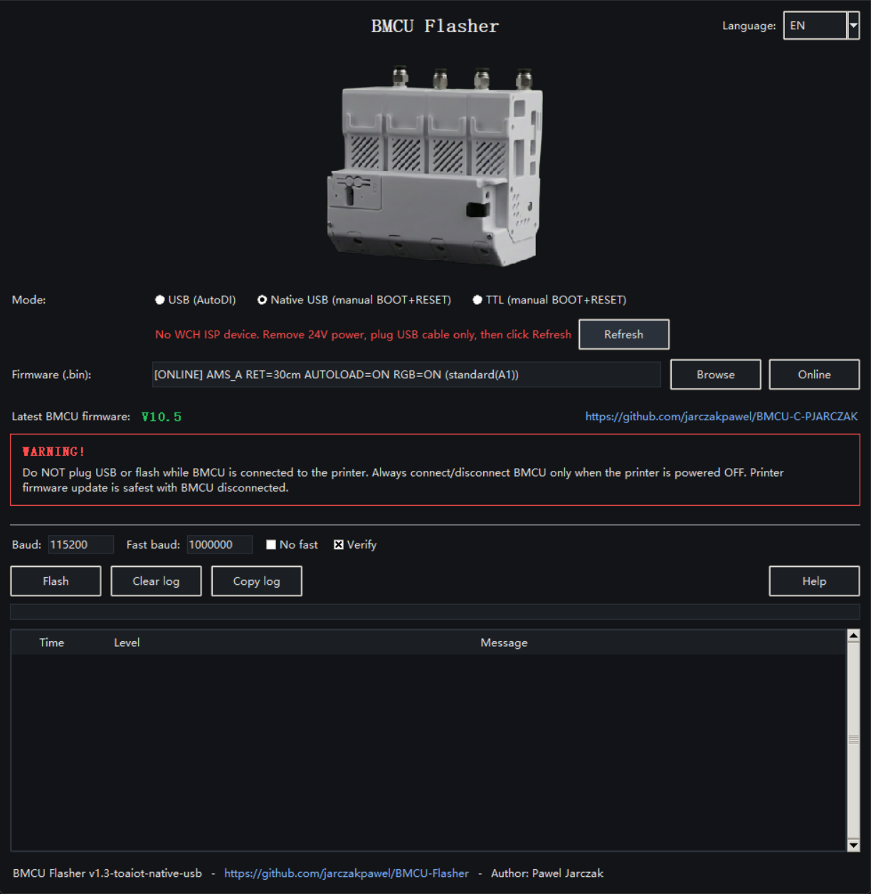

<h1 align="center">⚡ toaiot Custom Build — Native USB</h1>

<p align="center">
  Custom fork of <a href="https://github.com/jarczakpawel/BMCU-Flasher">BMCU-Flasher</a>
  (upstream <strong>v1.3</strong>) by <strong>toaiot</strong>, adding a
  <strong>Native USB</strong> flashing mode.
</p>

## What's new vs upstream v1.3

| Feature | Description |
|---|---|
| **Native USB mode** | Flash via the CH32V203 built-in USB ISP bootloader (device `4348:55E0`) — no CH340 / serial cable needed |
| **No-power workflow** | Remove 24V, plug USB only → chip auto-enters bootloader (no BOOT/RESET pressing) |
| **Device status row** | GUI shows live WCH ISP device detection before flashing |
| **Packaged drivers** | All builds bundle pyusb/libusb; Windows build includes `CH375DLL64.dll` |
| **24V-safe prompts** | Pre/post-flash instructions adapted for 24V-disconnected flashing |

## How to use Native USB mode

1. **Remove 24V power** from the BMCU board (never plug USB while 24V is connected)
2. Plug the USB cable into the BMCU's native USB port — it enters bootloader automatically
3. Start the app → select **Native USB (manual BOOT+RESET)** → the status row turns green when ready
4. Click **Flash** → after it finishes, remove USB, reconnect 24V, wait ~4 min for channel calibration



CLI: `python3 bmcu_flasher.py firmware.bin --mode native_usb`

Driver requirements (Native USB mode only):

| Platform | Requirement |
|---|---|
| Windows | WCH CH372 driver (CH375DLL64.dll bundled) or WinUSB via Zadig |
| Linux | udev rule: `SUBSYSTEM=="usb", ATTRS{idVendor}=="4348", ATTRS{idProduct}=="55e0", MODE="0666"` |
| macOS | none (libusb bundled) |

> ⚠️ **Important**: flashing is only supported with **24V disconnected**. Never plug USB while the board is powered by 24V.

---

<h1 align="center">Support</h1>

<p align="center">
  Bambu Lab continues tightening compatibility around BMCU, and there is a growing risk that BMCU may eventually become unusable in that ecosystem.
</p>

<p align="center">
  To prepare for that, I want to build BMCU support for open-source Klipper-based printers.
</p>

<p align="center">
  I am currently raising funds to buy a test printer for this work.
</p>

<p align="center">
  The $500 goal does not need to be reached in full. If I manage to save the remaining amount myself, I will cover the rest out of my own pocket.
</p>

<p align="center">
  <a href="https://ko-fi.com/jarczakpawel/goal?g=0">
    
  </a>
</p>

<p align="center">
  <a href="https://ko-fi.com/jarczakpawel/goal?g=0"><strong>Support on Ko-fi</strong></a>
  ·
  <a href="https://revolut.me/paweqxdkx"><strong>Support via Revolut</strong></a>
</p>

<p align="center">
  Direct Revolut support avoids Ko-fi fees, so more of your contribution goes directly to the project.
</p>

# BMCU Flasher

Cross-platform flasher for BMCU (WCH ISP protocol).


- OS: Linux / Windows / macOS / Android
- Modes:
  - USB (BMCU with CH340 on board, AutoDI)
  - Native USB (BMCU's own USB port, manual BOOT + RESET, no CH340 needed)
  - TTL (pin header / external USB-Serial, manual BOOT + RESET)
- Android:
  - USB (CH340 + USB OTG)
  - TTL (external USB-Serial, manual BOOT + RESET)
  - Online flash only (no local .bin picker)
  - App language follows system language

## Download
Download prebuilt binaries from Releases.

Main builds:
- Windows x64: BMCU-Flasher-windows-x64.zip
- Windows x86: BMCU-Flasher-windows-x86.zip
- macOS Apple Silicon (arm64): BMCU-Flasher-macos-arm64.zip
- macOS Intel (x86_64): BMCU-Flasher-macos-x86_64.zip
- Linux x64: BMCU-Flasher-linux-x64.tar.gz
- Linux arm64: BMCU-Flasher-linux-arm64.tar.gz
- Android APK: BMCU-Flasher-android.apk

Legacy / experimental / community (older OS, best-effort):
- Windows legacy (older Windows): BMCU-Flasher-windows-legacy-x64.zip, BMCU-Flasher-windows-legacy-x86.zip
- macOS Catalina 10.15 (Intel): BMCU-Flasher-catalina-1.2.1.zip (community build by Doyle4, tested on Catalina)
- macOS legacy try (CI attempt): BMCU-Flasher-macos-x86_64-legacy-try.zip (may not run on Catalina)

## Android requirements
- Android 5.0+ (API 21+) (minSdk=21)
- USB OTG + USB host mode
- CH340 supported for USB mode
- External USB-Serial adapters supported for TTL mode
- Do NOT plug USB or flash while BMCU is connected to the printer

## Firmware
Latest BMCU firmware:
https://github.com/jarczakpawel/BMCU-C-PJARCZAK

GUI has "Online" firmware selection (no manual searching/downloading):
- choose mode (Standard / Soft load / High force)
- choose slot (SOLO / AMS_A / AMS_B / AMS_C / AMS_D)
- choose retract length, AUTOLOAD, RGB
- the app downloads the selected firmware and flashes it

## Drivers (CH340)
In USB mode (CH340), drivers may be required on Windows.
Linux and macOS usually work out-of-the-box.

## Usage
GUI (recommended):
- Run the app
- Click "Online" to pick the exact firmware variant (mode / slot / retract / autoload / RGB)
- Click "Help" inside the app (wiring + BOOT/RESET steps)

Android:
- Install APK
- Choose USB or TTL mode
- USB mode: plug BMCU via USB OTG
- TTL mode: connect external USB-Serial adapter and enter BOOTloader manually
- Select firmware options
- Click "Flash"

CLI (optional):
- USB (auto port by VID/PID):
```bash
python3 bmcu_flasher.py firmware.bin --mode usb
```
- TTL (manual BOOT+RESET, port required):
```bash
  python3 bmcu_flasher.py firmware.bin --mode ttl --port /dev/ttyUSB0
```
- Native USB (BMCU's own USB port, manual BOOT+RESET, no port required):
```bash
  python3 bmcu_flasher.py firmware.bin --mode native_usb
```

Native USB mode uses the CH32V203 built-in USB ISP bootloader (device 4348:55E0). Transport backends:
- Windows: WCH CH375 driver (`CH375DLL64.dll`, no extra Python deps) or WinUSB via Zadig + `pyusb`
- Linux/macOS: `pip install pyusb` + libusb (see wchisp udev rules: `SUBSYSTEM=="usb", ATTRS{idVendor}=="4348", ATTRS{idProduct}=="55e0", MODE="0666"`)

## License
MIT - see LICENSE.
